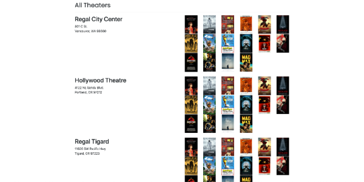

# We Love Movies

## Description

We Love Movies is a movie theater platform designed to help users navigate movies and showing theaters.

## Getting Started

### Home

### All Movies

### All Theaters

### Detailed Movie

### Movie Review

## Technology

- Express used to build server and routes
- Built CRUD functionality with middleware functions for movies, reviews, and theaters
- Implemented Knex library to build SQL queries
- Set up database with PostgreSQL to store information

## Future Goals

- Implement user authentication and authorization for specific routes
